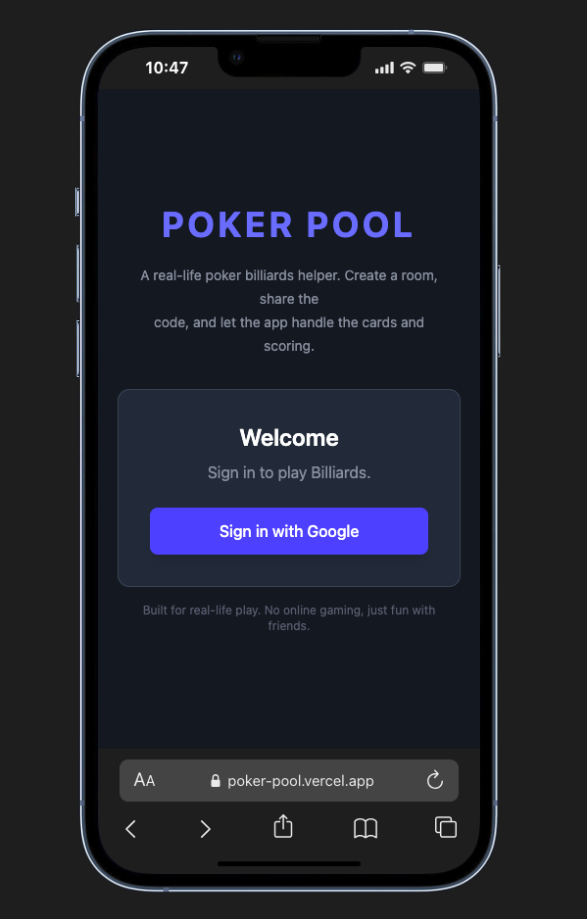
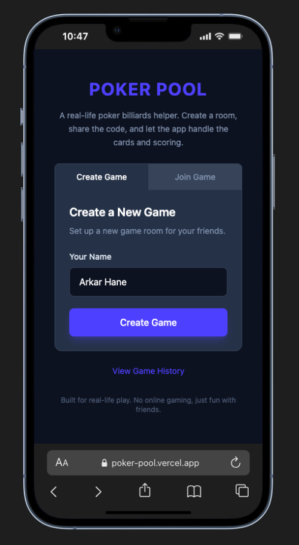
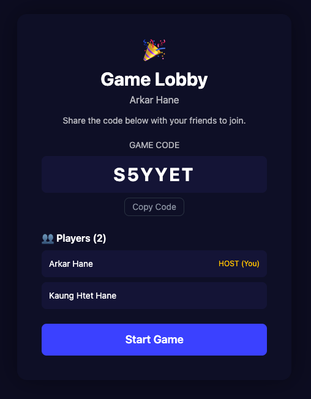
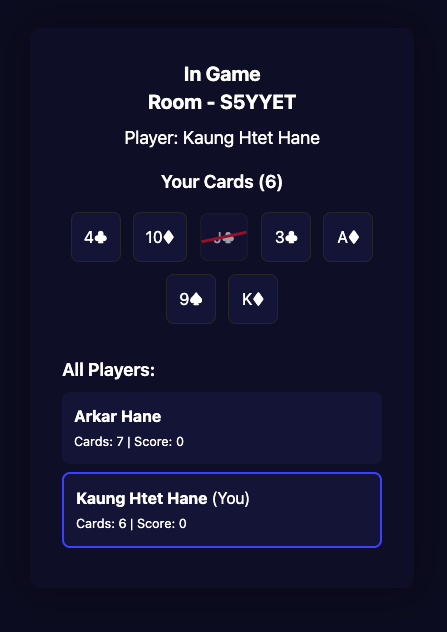

🎱 Poker Pool — Multiplayer Card-Based Billiards Game

Poker Pool is a fun, lightweight, multiplayer web app inspired by the billiards-style card games I used to play back in Yangon.
Each player receives 7 cards, and the goal is to score all 7 before anyone else—just like pocketing balls in pool, but using poker cards.

Since using real cards in public isn’t allowed in Thailand, I built this digital version to play with friends anytime, anywhere.
No gambling. No money. Just a simple, realtime card game for entertainment.

🚀 Tech Stack

Firebase Auth – Google Login

Firestore – Realtime game rooms + card sync

React + Vite – Frontend UI

Vercel – Deployment

🎯 Features

Create or join a game room

Draw 7 cards automatically

Realtime card updates for all players

Only room host can reshuffle cards

Share room code with friends

Works on mobile & desktop

# React + Vite

This template provides a minimal setup to get React working in Vite with HMR and some ESLint rules.

Currently, two official plugins are available:

- [@vitejs/plugin-react](https://github.com/vitejs/vite-plugin-react/blob/main/packages/plugin-react) uses [Babel](https://babeljs.io/) (or [oxc](https://oxc.rs) when used in [rolldown-vite](https://vite.dev/guide/rolldown)) for Fast Refresh
- [@vitejs/plugin-react-swc](https://github.com/vitejs/vite-plugin-react/blob/main/packages/plugin-react-swc) uses [SWC](https://swc.rs/) for Fast Refresh

## React Compiler

The React Compiler is enabled on this template. See [this documentation](https://react.dev/learn/react-compiler) for more information.

Note: This will impact Vite dev & build performances.

## Expanding the ESLint configuration

If you are developing a production application, we recommend using TypeScript with type-aware lint rules enabled. Check out the [TS template](https://github.com/vitejs/vite/tree/main/packages/create-vite/template-react-ts) for information on how to integrate TypeScript and [`typescript-eslint`](https://typescript-eslint.io) in your project.

  

  

  

  

